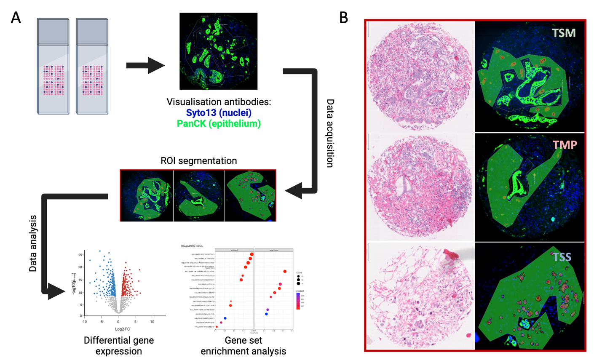

# Welcome!
Code accompanying our project on "Identifcation of phenotypic switching of colorectal tumour buds in response to tumour-microenvironment using spatially resolved transcriptomics", abstract available [here](https://link.springer.com/article/10.1007/s00292-023-01249-7).

### Overview
This repo contains code for all analysis steps, from gene counts to pathway enrichment analyses and spatial deconvolution. 
The data processing steps were handled by Nanostring's `GeoMx NGS pipeline v2.3.3.10`.

### Profile matrices
We built custom cell profile matrices from colorectal cancer single-cell data for the deconvolution tasks. The data is freely accessible from Pelka & al.'s [article](https://www.cell.com/cell/fulltext/S0092-8674(21)00945-4) "Spatially organized multicellular immune hubs in human colorectal cancer".
Two matrices are available in `./Master_files`: the "top" matrix groups together similar cell types, and the "mid" categories are a bit more detailed. Short descriptions for the cell type names are available [here](./Master_files/name_mapping.xlsx).

### DGE, GSEA and Deconvolution
#### R environment/dependencies
All R packages/dependencies can be installed at once using the `renv` lockfile in `./Scripts`. `renv` allows us to build and share environment files in a similar way to `conda`. Once renv is installed and your R project is initiated, run `renv::restore()` to load the environment, making sure that `renv.lock` is in the project directory. 

Note: This was built in R version 4.2.2 and although renv tracks the R version, it cannot change/update it. You might have to manually update some packages if your R version is different.
 
#### R scripts
Quality control of the data processing results is done using script [0](./Scripts/0_DSPQC_FILTERING.R). The data exploration steps (PCA, GSVA) are covered in script [1](./Scripts/1_TB_QCGSVA.R). Details on the differential gene expression, GSEA and ORA can be found in script [2](./Scripts/2A_TB_DGE.R). The spatial deconvolution is in script [3](./Scripts/3_TME_DCV.R).

The two remaining scripts were to build the custom profile matrices: `./Scripts/MK_CSTM_PRF_MTX.R`

And to check for contamination in the epithelial compartment: `./Scripts/2B_TB_DCV.R` 

